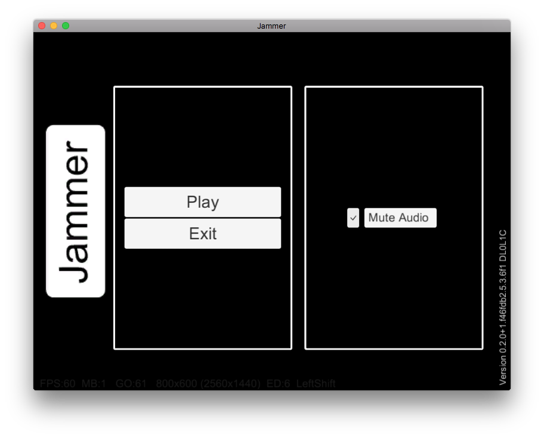
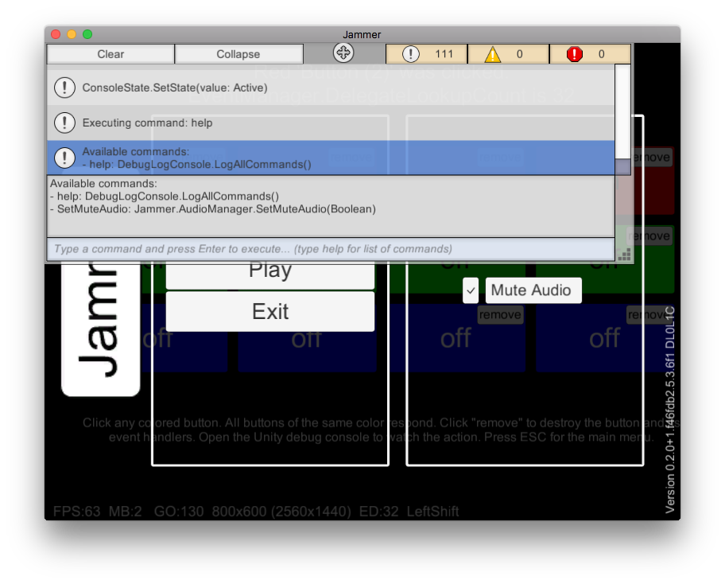

Jammer
======

Unity game jam template with just enough structure to ease moving past the jam phase.

Take a look at the feature list to see if this project will work for you.

Screenshots
-----------

### Menu

### Command Line Tasks

See [./doc/screenshots](doc/screenshots/) for more.

Project Status
--------------

Created with Unity 5.3.6f1. 

This is a work in progress. The following features need to be added or wired up.

* Audio mixer. (Audio on/off currently implemented)

Features
--------

* Loosely coupled, type safe event system
* Unit testing of custom framework for both straight-up C# and Unity MonoBehaviours
* Single scene or multi-scene game support. Play testing can be started from any scene to speed development.
* Lighting fast syntax checking for Vim users
* Optional Ruby scripting framework to make CLI tasks easy to create and
  maintain.  See [./tasks/README.md](tasks/README.md)
* Granular Unity debug log wrapper with source [./src](src) but compiled to DLL
  [./Assets/Lib](Assets/Lib) to avoid wrapper functions junking up your stack traces.
  Conditionally compiled to allow complete trace logging removal for production
  builds.  Rebuild via `thor compile:base`
* Player prefs alternative that serializes to JSON in a predictable location on all platforms
* On screen debug status line for FPS, Memory, Event Delegates, ScreenSize, KeyCodes, etc
* In-game debug console for logging and input. Use `KeyCode.BackQuote` to activate.
* Itch.io Butler package helpers for macOS, Windows, and Linux. See See [./tasks/itch.rb](tasks/itch.rb)
* Code based tweening used when appropriate as an alternative to Mechcanim for maintainability.

Assets
------

### Debug Console

### Included in Template

Several free and open source vendor assets are included. Most game types will
benefit from all of these vendor assets. None are required and can be removed
by deleting the appropriate folder from
[./Assets/Plugins/Vendor](Assets/Plugins/Vendor). All can be redistributed with
your source.

* UnityTestTools for unit and integration testing. https://www.assetstore.unity3d.com/en/#!/content/13802
* ConsoleE a free replacement Unity debug trace console. https://www.assetstore.unity3d.com/en/#!/content/42381
* Json.Net.Unity3D a Unity friendly fork of Newtonsoft.Json. https://github.com/SaladLab/Json.Net.Unity3D
* DOTween for fire and forget performant tweening. https://www.assetstore.unity3d.com/en/#!/content/27676
* UnityIngameDebugConsole for in game logging and console input. https://github.com/yasirkula/UnityIngameDebugConsole

### Post Jam Assets, Not Included in Template

Cleaning up your game after the Jam? These non-free assets should will make any
Unity Dev happy. Alas, you can't redistribute these asset binaries or source so
they are NOT included in this toolkit but they are highly recommended for post
jam updates.

* ConsoleE Pro.  Like the free one above but better. https://www.assetstore.unity3d.com/en/#!/content/11521
* Text Mesh Pro. SDF Fonts! Seeing is believing. This asset should be part of stock Unity. https://www.assetstore.unity3d.com/en/#!/content/17662
* JSON.NET for Unity. Enhanced version of Newtonsoft.Json with good compatibility and excellent support. https://www.assetstore.unity3d.com/en/#!/content/11347
* Rewired. First class input support. Your controller will thank you. https://www.assetstore.unity3d.com/en/#!/content/21676

Usage
-----

### Installation

Unity and vendor assets want to control their own line endings.
This mean that turning off git's autocrlf is the path of least resistance.

#### Clone Jammer

    cd ~/workspace
    # NOTE the "-n" to clone but not checkout
    git clone git@github.com/robertwahler/jammer.git my_game -n
    cd my_game 
    git config core.autocrlf false
    git checkout

### Make Your Game

* Completely replace the contents of scene file Level1.unity with your game
* Delete the ./Examples folder

Scenes
------

NOTE: You can play test from any scene while in the IDE. UI and managers will
be loaded on awake regardless of which scene is currently being edited.

### Splash

Shows game banner logo at start, automatically loads the start scene

### Start

An empty scene that acts the the game's home screen, automatically loads the UI

### UI

The menu system. It is in its own scene instead of a prefab so that the menus
can themselves, be constructed of prefabs. It is loaded dynamically when needed
and stays in memory for the entire session.

### Level1

Demo game/level scene. Replace its contents with your game

JSON Serialization
------------------

This template uses a JSON serialization system as an alternative to Unity's
player prefs.  Game saves and custom game configuration settings are located in
a platform specific folder in standard JSON format. 

Different locations are used depending on the build type.

### Unity Editor 

Save data is stored in `./tmp/settings`. This allows development settings to be
different than production. i.e. turn off the audio when working in the IDE.

### Unity Editor Tests

Save data is stored in `./tmp/test`. This allows the test suite to easily mock
serialization data.

### Standalone 

#### Windows

    ~/AppData/LocalLow/<%= company_name %>/<%= product_name %>/

#### macOS

    ~/Library/Application Support/<%= company_name %>/<%= product_name %>/

#### Linux

    ~/.config/unity3d/<%= company_name %>/<%= product_name %>/

Preprocessor Directives
-----------------------

Compiler defines conditionally control compilation.

To use, add then to Unity's `Player Settings, Other Settings, Scripting Define Symbols`. 

The letters `[D]` denote strings shown at runtime with the games version.  This
helps determine what defines were enabled for any given build.

#### SDD_DEBUG [D]

Controls misc debugging functions. Strips Verbose and Debug logging when
missing.

#### SDD_LOG_DEBUG [L0]

Enable LogLevel debug. Requires SDD_DEBUG otherwise debug logs are stripped out.

#### SDD_LOG_VERBOSE [L1]

Enable LogLevel verbose. Requires SDD_DEBUG otherwise verbose logs are stripped
out. Setting verbose doesn't set debug.  They are separate options.

#### SDD_DEBUG_OVERLAY

Shows the debug overlay stats line on all screens.

Testing
-------

The NUnit test framework is included in Unity 5.3 and higher.  Tests require
installation of the UnityTestTools asset for Unity 5.2 and lower.

### Running tests from Unity IDE

There is no Unity hotkey for running tests. Instead, manually use this menu sequence:

    Main Menu: Window, Editor Tests Runner
    Editor Tests: Run All

#### Using Guard and the NUnit-console (CI)

This command will watch for file changes and automatically run the unit test
suite. The Unity IDE can be running.

    bundle exec guard

Syntax checking with Vim
------------------------

Do you use Vim instead of MonoDevelop/Visual Studio? 

Omnisharp for Vim is good, https://github.com/OmniSharp/omnisharp-vim but it
has a few issues on macOS. I disable Omnisharp's syntax checking and use Neomake
and self parsed solution files.

### Install Neomake

https://github.com/neomake/neomake 

Add this to your .vimrc

    let g:neomake_cs_mcs_maker = {
      \ 'args': ['@.mcs'],
      \ 'errorformat': '%f(%l\,%c): %trror %m',
      \ }

Errors can be viewed via :lopen

### Create .mcs file

NOTE: See [tasks/README.md](tasks/README.md) for thor setup.

    thor compile:mcs

License
-------

MIT, see [LICENSE](LICENSE) for details.
